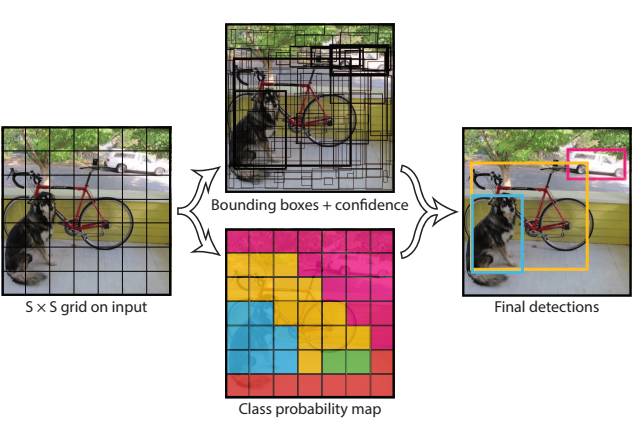
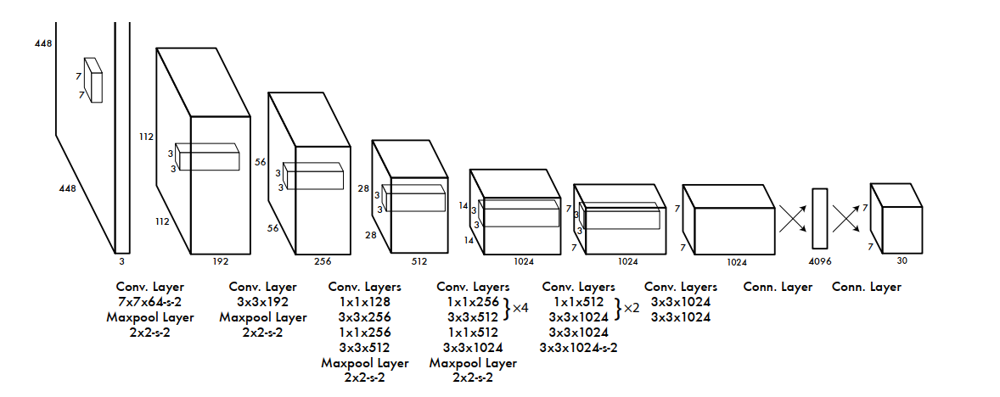
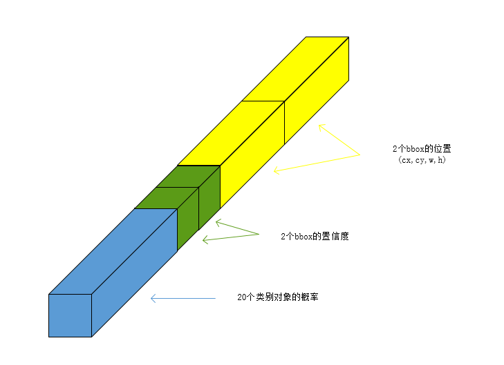
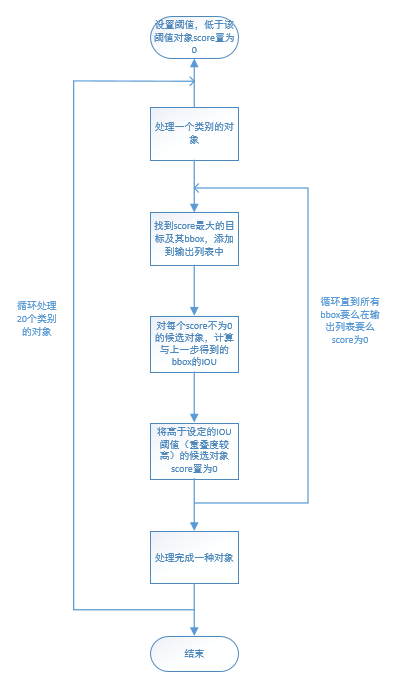
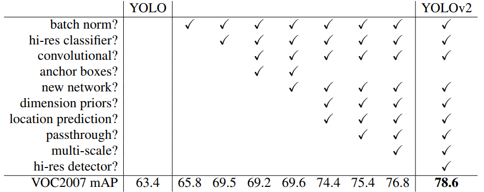
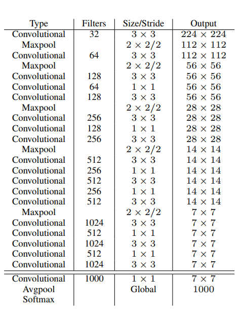
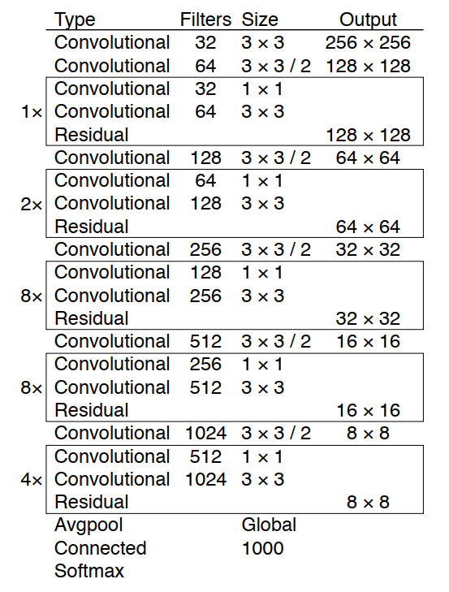
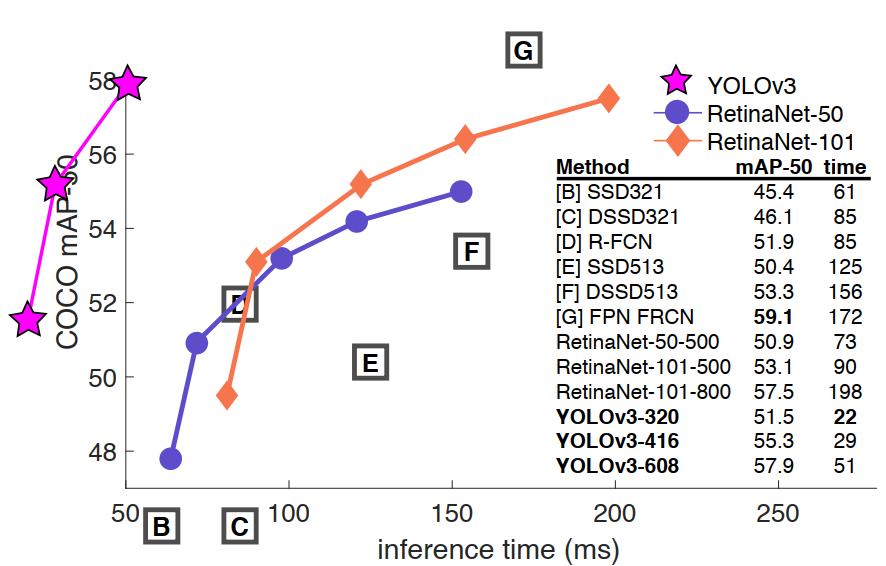

# YOLO算法

## 简介
本文主要介绍YOLO算法，包括YOLOv1、YOLOv2/YOLO9000和YOLOv3。YOLO算法作为one-stage目标检测算法最典型的代表，其基于深度神经网络进行对象的识别和定位，运行速度很快，可以用于实时系统。了解YOLO是对目标检测算法研究的一个必须步骤。

## 目标检测思路
目标检测属于计算机视觉的一个中层任务，该任务可以细化为**目标定位**与**目标识别**两个任务，简单来说，找到图片中存在某个对象的区域，然后识别出该区域的具体对象是什么。**上述这两个过程就是目标检测中很常用的two-stage方法（两阶段检测）。**

目标识别（给定一张包含一个目标的图片，该目标占据图片大部分区域，要求识别出图片中目标的类型）属于计算机视觉的基本任务，这些年以卷积神经网络为核心的深度识别网络已经做得很好了。所以剩下的问题就是目标的定位。

当然，目标的定位有个很直接很粗暴的想法：遍历图片中所有可能的位置，搜索不同大小、宽高比的所有区域，逐个检测其中是否存在某个目标，以概率最大的结果作为输出。显然，这种思路也许精度还行，但是效率太低。

## RCNN系
RCNN极具开创性地提出了候选区的方法（Region Proposals），先从输入图像中找到一些可能存在对象的候选区，这个过程称为Selective Search。在RCNN中这些候选区大概会有2000个，对这些区域进行目标识别即可完成检测（提出候选区，对候选区进行识别，这就是two-stage的具体两步）。候选区的提出大大减少了目标定位的时间，提高了目标检测的效率。

不过。。。

RCNN依然很慢，它为后来实时检测提供了可能，但也只是可能而已。后续的Fast RCNN和Faster RCNN则将这种可能变为了现实，它们针对网络结构和候选区算法进行了很多改进，已经可以达到平均0.2秒一张图片的速度。由于RCNN系并非本文重点，这里不多赘述，具体其效率变化如下表。

|        算法        | 平均单图处理时长(second) |
|:---:|:---:|
| RCNN | 49 |
| Fast RCNN | 2.3 |
| Faster RCNN | 0.2 |

## YOLOv1
YOLO算法（全名You Only Look Once，代表只需要看一眼图片就能完成目标检测），其作者为Joseph Redmon，被称为YOLO之父，其本人在2020年初由于自己的开源算法用于军事和隐私问题，宣布退出CV领域。

YOLO创造性地将候选区和目标识别两个阶段合二为一，look once即可完成目标检测，也实现了端到端的目标检测。事实上，YOLO并没有去掉候选区，而是使用一种预定义的类似候选区的预测区域。它将图片划分为$S\times S$个网格（论文中$S=7$，下文均使用7为例），也就是49个网格每个网格允许预测出两个bbox（bounding box，边界框），共98个。也可以理解为预定义了98个候选区。

为什么这样做呢？其实也是有理由的。RCNN虽然找到了不少候选区，但是毕竟只是候选区，在完成目标识别之后，还需要对候选区进行调整以获得更加准确的bbox位置，这个过程就是**边框回归**。YOLO当然就可以这样想：既然最后总要调整，为什么不一开始就定义一个粗略的区域范围，费劲找那么多候选区干嘛。

### 网络结构
YOLO的网络结构示意图如下，就是堆叠了卷积池化最后加了两层全连接，不过，由于是为了预测bbox等数值信息，并没有采用softmax作为输出的激活函数，而是采用了线性激活函数。整体来看，就是一个448\*448\*3的图片经过复杂的神经网络变换得到了一个输出张量，这个张量的尺寸是7\*7\*30。所以理解YOLO无需太过在意中间一系列卷积网络，弄明白输入输出的关系就行了。

输入要求为448\*448的图片大小，这样才能固定得到输出张量的大小，因此输入先缩放到448\*448。通过上面的结构不难得到，输出为一个尺寸为7\*7\*30的张量。其实不难理解，输入有49个网格，输出有49个30维向量，那么输入时划分的每一个网格对应输出张量相应位置的向量为输出，举个例子，第一行第一列的网格在输出张量中就是第一行第一列的向量。

那么如果存在跨网格的对象是不是就难以识别呢，其实不然，经过卷积神经网络的复杂提取和变换，网格周围的信息其实也被编码到这个30维向量中了。

 
这个30维向量的训练目标即ground truth是什么呢，也就是说，这30个元素代表什么呢？具体含义如下图。其中，前20个值代表YOLO设计之初识别的20种目标在该位置存在的概率，记为$P(C_i|Object)$，表示若该网格存在一个目标，则它是$C_i$的概率；最后8个值表示两个bbox的位置，每个bbox需要四个值来表示，分别为(center_x,center_y,width,height)；以及中间两个值表示两个bbox的置信度，其计算公式如下。

$$\text {Confidence}=\operatorname{Pr}(\text {Object}) * \text {IOU}_{\text {pred}}^{\text {truth}}$$

上式含义为bbox的置信度等于该bbox内存在目标的概率和该bbox与实际bbox的IOU乘积。这是针对训练而言的，也就是用于计算预测准确程度的损失函数的一部分，实际使用训练好的YOLO算法是没有实际的bbox进行参考的，因而没有IOU。简单说来，bbox的置信度表示它是否包含目标且位置准确的程度。

到此，我们理清了YOLO的网络结构，可以发现这其实就是一个**深度回归器**。它是完全可以进行**端到端训练**的，那么依据输出得到的损失函数是什么呢？就是下面的式子（由于Markdown公式语法，其中显示可能有点问题）。

$$\begin{array}{c}
\lambda_{\text {coord }} \sum_{i=0}^{S^{2}} \sum_{j=0}^{B} \mathbb{1}_{i j}^{\text {obj }}\left[\left(x_{i}-\hat{x}_{i}\right)^{2}+\left(y_{i}-\hat{y}_{i}\right)^{2}\right] \\
+\lambda_{\text {coord }} \sum_{i=0}^{S^{2}} \sum_{j=0}^{B} \mathbb{1}_{i j}^{\text {obj }}\left[(\sqrt{w_{i}}-\sqrt{\hat{w}_{i}})^{2}+(\sqrt{h_{i}}-\sqrt{\hat{h}_{i}})^{2}\right] \\
+\sum_{i=0}^{S^{2}} \sum_{j=0}^{B} \mathbb{1}_{i j}^{\text {obj }}\left(C_{i}-\hat{C}_{i}\right)^{2} \\
+\lambda_{\text {noobj } j} \sum_{i=0}^{S^{2}} \sum_{j=0}^{B} \mathbb{1}_{i j}^{\text {noobj }}\left(C_{i}-\hat{C}_{i}\right)^{2} \\
+\sum_{i=0}^{S^{2}} \mathbb{1}_{i}^{\text {obj }} \sum_{c \in \text { classes }}\left(p_{i}(c)-\hat{p}_{i}(c)\right)^{2}
\end{array}$$

$\mathbb{1}_{i}^{\text {obj }}$表示网格$i$中存在对象，$\mathbb{1}_{ij}^{\text {obj }}$表示网格$i$的第$j$个bbox中存在对象，上标为noobj表示不存在对象。

上式第一行表示边框中心位置误差（(cx,cy)误差），第二行表示边框宽度和高度误差，第三行表示边框内有目标的置信度误差，第四行表示边框内无目标的置信度误差，最后一行表示目标分类误差。总的来说，就是网络输出与真实标签的各项内容的误差平方和作为最后的输出误差，上述五项和30维输出是对应的。$\lambda_{\text {coord}}$用于调整bbox误差的权重，YOLO设置为5。

### 训练
YOLO现在ImageNet数据集上训练前20层卷积网络，让网络获得一部分图像特征提取能力，然后在Pascal VOC数据集上进行目标检测的训练。除了最后一层使用线性激活函数，其他层均使用Leaky Relu，同时采用Dropout和Data Augmention来控制过拟合的发生。

### 预测
训练完的YOLO网络就可以进行目标预测了，在此之前需要明确下面几个点。原论文的YOLO结构最多识别49个目标；通过调整网络结构可以识别更多的对象；YOLO中的预定义bbox和Faster RCNN中的Anchor不一样，并没有设定bbox的位置和大小，只是表示对一个目标预测两个bbox，选择可能性较大的那个，仅此而已。

训练完成的YOLO网络就可以进行目标检测了，不过它的输出是49个30维向量，表示网格包含的对象类别以及该对象的可能两个bbox位置和对应的置信度。为了向量中提取最有可能的目标及其位置，YOLO采用NMS（Non-maximal suppression，非极大值抑制算法）来实现。

NMS算法并不复杂，其核心思想非常简单：选择score最高的作为输出，与其重叠的删除，反复迭代直到处理完所有备选。在YOLO中定义score如下式，表示每个网格中目标$C_i$存在于第$j$个bbox的概率。

$$\text {score}_{i j}=P\left(C_{i} | O b j e c t\right) * \text { Confidence}_{j}$$

不难算出，共有$20*2*49=1960$个得分，吴恩达对于nms的思路为分类别进行，所以每个类别是98个score。

NMS步骤如下图。

### 总结
YOLO提出时由于one-stage特性，速度很快，FPS可以达到45，总体精度低于FastRCNN。遗憾的是，由于网格稀疏，对小对象预测效果较差。总的来说，为工业实时检测提供了新的思路。

## YOLOv2/YOLO9000
在YOLO系列中是第二个作品，由于原论文标题为YOLO9000，所以更多人愿意称YOLO2为YOLO9000。作者还是Joseph Redmon，就像论文名YOLO9000:better,faster,stronger一样，在保持高速处理的前提下，better（精度更高）、faster（速度更快）、stronger（目标更多）三个方面进行优化，目标类别因为加到了9000种，因此称为YOLO9000。

### better

下图具体描述YOLO9000为了获得更好的mAP（**better**），所做的工作的效果。

- **Batch Normalization**被应用到了网络中（放弃了Dropout），有着更快的收敛以及更好的防止过拟合效果。
- **High resolution classifier**（高分辨率图像分类器）用于预训练特征提取网络，文中使用448\*448的图像作为输入而不是用YOLO1的224\*224作为输入图像大小。
- **Convolutional With Anchor Boxes**，参考Fast RCNN的做法，在每个网格设置不同大小、宽高比的先验框（anchor boxes），作为预定义的候选区在神经网络中检测其中是否包含目标以及边框微调。同时，移除顶部的全连接层以及一个池化层，是的卷积层输出分辨率较高
- **Dimension Clusters**，通过基于IOU的边框聚类从数据集中学习到更加合适的先验框（anchor box），减少边框微调的成本。
- **Direct location prediction**，对bbox中心进行约束至一个网格内，从而是的模型早期学习稳定且更容易训练。
- **Fine-Grained Features**，设计passthrough层将pooling之前的信息直接传递到最后的输出特征图从而保留一些细节上的信息，该方法可以改善小目标识别信息不足的问题。
- **Multi-Scale Training**，多尺度图像训练，因为去掉了全连接层，网络的固定输入限制解除了，整个网络的下采样倍率为32，训练是随机更换训练的输入尺寸，使得网络对各种大小的目标有不错的检测效果。

### faster

同样，为了获得更快的速度（**faster**），提出了Darknet19网络结构，该结构包含19个卷积层和5个池化层，相比于VGG16小一些，但精度毫不逊色，且运算量大大减少。其具体结构如下图。

YOLO2的训练分为三个阶段。首先，是224输入的Imagenet的Darknet19预训练（160轮）；接着，是调整输入为448的Imagenet上的Finetune训练（10轮）；最后，移除Darknet最后的卷积层、全局池化层以及Softmax分类层，新增三个卷积核为（3,3,1024）的卷积层和一个passthrough层，最后使用(1,1)的卷积层输出检测结果。输出为对应网格数的向量，向量维度为$anchors\_num*(5+classes\_num)$，由于anchors为5，对20中对象的VOC数据集输出为(13,13,125)，可以将125为向量理解为5个bbox的预测结果，25个值分别表示bbox的位置和大小以及置信度(tx,ty,tw,th)、Confidence，以及20个值表示的类别结果。

对应的损失函数也调整如下。

$$\begin{array}{rl}
\operatorname{loss}_{t}=\sum_{i=0}^{W} \sum_{j=0}^{H} \sum_{k=0}^{A} & 1_{\text {Max}  IOU<\text {Thresh}} \lambda_{\text {noobj}} \cdot\left(-b_{i j k}^{o}\right)^{2} \\
& +1_{t<12800} \lambda_{\text {prior}} * \sum_{r \epsilon(x, y, w, h)}\left(\text {prior}_{k}^{r}-b_{i j k}^{r}\right)^{2} \\
& +1_{k}^{\text {truth}}\left(\lambda_{\text {coord}} \cdot \sum_{r e(x, y, w, h)}\left(\text {truth}^{r}-b_{i j k}^{r}\right)^{2}\right. \\
& +\lambda_{\text {obj}} *\left(IOU_{\text {truth}}^{k}-b_{i j k}^{o}\right)^{2} \\
& \left.+\lambda_{\text {class}} *\left(\sum_{c=1}^{c}\left(\text {truth}^{c}-b_{i j k}^{c}\right)^{2}\right)\right)
\end{array}$$

### stronger

至于更强（stronger）的算法能力则依赖大量数据集，采用Imagenet和VOC数据集进行分类模型和检测模型联合训练的方法实现9000中对象的检测，具体可以查阅原论文。

### 总结
YOLO2在参考RCNN系列检测的前提下，自行设计了网络结果和训练优化手段，取得了不错的效果，为很多检测算法提供了新的思路。

### YOLOv3
YOLO3可能是现在目标检测领域提的最多的YOLO系算法，因为它比较新且是之前YOLO算法的集大成者。作者依旧是Joseph Redmon，并且开源了代码和模型参数，由于作者个人原因，这应该是YOLO系列最后一个作品。但是相比于之前的两个YOLO版本，这个版本反而是突破最少的，主要是借鉴了一些CV中好的方法集成到了自己的算法中，尤其对于微小目标的识别有了更好的效果，所以YOLO3的论文其实非常简短，单看YOLO3是不可能了解YOLO算法的。

### 网络结构
借鉴ResNet的做法，设计了新版本的Darknet网络，由于含有53个卷积层，又称为Darknet53，其配置如下图。主要是加入了一些残差模块。

### 多尺度特征
当然也不能放过这几年很火的多尺度特征融合，通过下采样和上采样联合的操作，对几个尺度的特征图进行融合（concatenation），以获取不同的感受野信息，通过三种尺度的特征融合分别获得了小、中、大目标的检测能力，这是对YOLO2中passthrough层的进一步拓展。也是拓展，是的算法对于各种大小的目标有了更强的检测能力。

### 分类激活函数
由原来的Softmax改为Logistic函数以支持多标签分类。

### 总结
相比于YOLO2，YOLO3没有什么太突破的成果，参照ResNet加深了网络结构，使用比较流行的多尺度融合提升了小目标检测效果。如果只考虑推理时间，在同等精度的情况下，YOLO3的速度是其他算法的3倍以上，具体如下图。不过，若是考虑具体精度（以mAP为metric的话），YOLO3相比其他算法还是差了一些，但这不妨碍它作为一个高速实时检测算法。

## 补充说明
本文主要介绍了YOLO系的目标检测算法，包括YOLOv1、YOLOv2/YOLO9000以及现在很实用的YOLOv3。由于YOLO3是对YOLO的补充优化，所以了解YOLO3必须要了解YOLO以及YOLO2。由于YOLO算法作者已经开源并且也有很多不同框架的实现开源在Github上，我并没有具体进行代码实现。本文的资源文件可以在该博文资源的Github仓库找到，欢迎star或者fork。

